### **1. The Strategy: Relational Core + Intelligence Layer**

The architecture is split into two zones: the **Operational Zone** (PostgreSQL) for league mechanics and ESPN data, and the **Cognitive Zone** (pgvector) for AI-driven news intelligence—both within the same Supabase PostgreSQL instance.

### ---

**2. FanVise Entity Relationship Diagram (Current)**

```mermaid
erDiagram
    %% Identity & Access (extends Supabase auth.users)
    PROFILES ||--o{ USER_LEAGUES : "enrolls in"
    PROFILES {
        uuid id PK "References auth.users"
        string username "Unique display name"
        string full_name "Display name"
        string avatar_url "Profile image"
        timestamptz updated_at
    }

    USER_SETTINGS {
        uuid user_id PK "References auth.users"
        text gemini_api_key_encrypted "BYOK API key"
        text espn_league_id "Active league (single-league mode)"
        text espn_team_id "Active team (perspective)"
        timestamptz created_at
        timestamptz updated_at
    }

    %% League & Rules Engine
    LEAGUES ||--o{ USER_LEAGUES : "has members"
    LEAGUES ||--o{ LEAGUE_TRANSACTIONS : "has"
    LEAGUES ||--o{ DAILY_LEADERS : "has"
    LEAGUES {
        text league_id PK "ESPN League ID"
        text season_id "e.g. 2025"
        text name
        jsonb scoring_settings "PTS, REB, AST weights"
        jsonb roster_settings "PG, SG, SF, PF, C slots"
        jsonb teams "Embedded team rosters"
        jsonb draft_detail
        jsonb positional_ratings
        jsonb live_scoring
        timestamptz last_updated_at
    }

    USER_LEAGUES {
        uuid id PK
        uuid user_id FK "References profiles"
        text league_id FK "References leagues"
        text team_id "User's ESPN team ID in this league"
        boolean is_active "Context switch toggle"
    }

    LEAGUE_TRANSACTIONS {
        uuid id PK
        text league_id FK
        text espn_transaction_id "Unique ESPN ID"
        text type "add, drop, trade"
        text description
        timestamptz published_at
        timestamptz created_at
    }

    %% Player Performance (denormalised, no central PLAYER table)
    PLAYER_GAME_LOGS {
        uuid id PK
        bigint player_id "ESPN player ID"
        text player_name
        text season_id
        int scoring_period_id "1 per game day"
        date game_date
        int pro_team_id
        numeric pts_reb_ast_stl_blk "Fantasy stats"
        numeric fantasy_points "League-scoring dependent"
        jsonb stats_raw "Full ESPN stat map"
        text source "espn_kona_playercard"
        timestamptz fetched_at
    }

    STAT_AGGREGATE {
        bigint player_id "From player_game_logs"
        text player_name
        text season_id
        int games_played
        numeric avg_pts_avg_reb_avg_ast "Per-game averages"
        numeric avg_fantasy_points
        timestamptz last_updated
    }

    PLAYER_STATUS_SNAPSHOTS {
        uuid id PK
        bigint player_id UK "ESPN player ID"
        text player_name
        int pro_team_id
        boolean injured
        text injury_status "Out, DTD, GTD"
        text injury_type
        boolean out_for_season
        date expected_return_date
        jsonb starter_status
        jsonb ownership
        timestamptz last_synced_at
    }

    DAILY_LEADERS {
        uuid id PK
        text league_id FK "References leagues"
        text season_id
        int scoring_period_id
        date period_date
        bigint player_id
        text player_name
        numeric fantasy_points
        jsonb stats
        numeric ownership_percent
        timestamptz created_at
    }

    %% Cognitive Layer (RAG)
    NEWS_ITEMS {
        uuid id PK
        text title
        text url UK
        text content
        text summary
        text full_content "Full article text"
        timestamptz published_at
        text source "espn, rotowire, etc."
        text player_name "Entity extraction"
        text sentiment "Positive/Negative impact"
        text category
        text impact_backup
        boolean is_injury_report
        text injury_status
        text expected_return_date
        text impacted_player_ids "Array of ESPN IDs"
        int trust_level "1-5"
        vector embedding "768-dim for RAG similarity"
        text guid "Deduplication"
        timestamptz created_at
    }

    NEWS_SOURCES {
        uuid id PK
        text slug UK "espn, rotowire, yahoo"
        text name
        text source_type "rss"
        text url
        int default_trust_level
        boolean is_default
        int display_order
    }

    USER_NEWS_PREFERENCES {
        uuid id PK
        uuid user_id FK "References auth.users"
        uuid source_id FK "References news_sources"
        boolean is_enabled
        int custom_trust_level
        timestamptz created_at
    }

    NBA_SCHEDULE {
        text id PK "ESPN Game ID"
        timestamptz date
        int home_team_id
        int away_team_id
        text season_id
        int scoring_period_id
        timestamptz created_at
    }

    %% Relationships
    NEWS_SOURCES ||--o{ USER_NEWS_PREFERENCES : "customized by"
```

**Note:** `STAT_AGGREGATE` is a **view** over `player_game_logs` (not a table). There is no central `PLAYER` table—players are identified by ESPN `player_id` (bigint) across logs, snapshots, and news.

### ---

**3. Intentional Design Choices & Implementation Logic**

* **The Perspective Engine:** `user_leagues` links each user to their teams across leagues. Combined with `user_settings.espn_league_id` and `espn_team_id`, the app switches perspective (e.g., to simulate an opponent) by updating these settings. Teams and rosters are embedded in `leagues.teams` JSONB—no separate TEAM/PLAYER_ROSTER tables.

* **JSONB for Scoring Settings:** ESPN leagues use different scoring weights (e.g., 1.2 vs 1.5 for a rebound). Storing `scoring_settings` and `roster_settings` as JSONB in `leagues` lets the AI pull league-specific weights into prompts for accurate trade and drop analysis.

* **Pre-calculated Stat Aggregates:** The `stat_aggregate` view aggregates `player_game_logs` into season-long per-game averages (pts, reb, ast, fantasy_points). The AI queries this view for fast value comparisons instead of computing on the fly. Raw game logs support "last N games" analysis via `scoring_period_id` and `game_date`.

* **Vector Integration (RAG):** `news_items` stores RSS/fetched content with 768-dim embeddings. The `match_news_documents` function performs similarity search to surface injury reports and news for player names. `player_name` and `impacted_player_ids` link news to players (no FK—ESPN IDs are denormalised).

* **Sync Separation:** League sync (metadata, transactions, player status, daily leaders) is distinct from news sync. News ingestion triggers Gemini extraction and embeddings only on explicit cron or manual sync paths.
