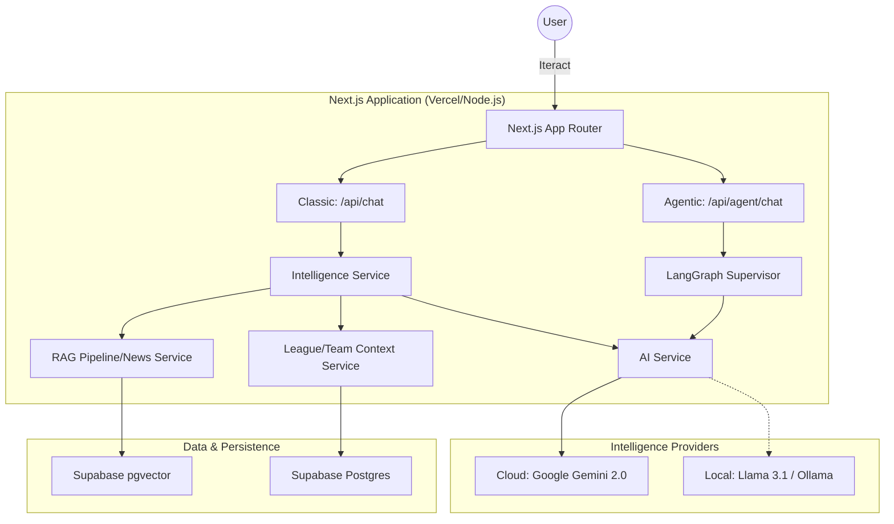

# System Architecture

FanVise is an AI-native fantasy sports intelligence platform designed as a "Strategist" layer on top of existing fantasy ecosystem. The application is built as a unified, standalone Next.js solution that integrates data ingestion, AI orchestration, and RAG pipelines into a single high-performance deployment.

## High-Level Overview

The system acts as a strategic co-manager for ESPN Fantasy Basketball. It aggregates structured data (league rosters, scoring) and unstructured intelligence (news, injury reports) to provide contextually grounded strategic advice. It employs a **Dual-Environment Architecture**, offering both high-performance cloud inference and privacy-focused local models.

## Dual-Mode AI Execution
The system provides two discrete AI execution paths:

1. **Classic Mode (`/api/chat`)**: A single-pass Retrieval-Augmented Generation (RAG) pipeline. This is the fastest, most reliable mode for general queries ("who should I start?"). 
2. **Agentic Mode (`/api/agent/chat`)**: Uses LangGraph to orchestrate autonomous agents with tool-calling capabilities (e.g., Live Player Research). Best for deep dives where the AI needs to iteratively search live web feeds or perform multiple data lookups.

## Models & Environments

The application routes requests via the `AI Service` to either cloud or local models, controlled by environment variables.

### 1. Google Gemini (Cloud)
Used for production and high-scale intelligence extraction.
- **Core Model**: `gemini-2.0-flash` (Optimized for speed/latency).
- **Embedding Model**: `gemini-embedding-001`.
- **Requirements**: Requires `GOOGLE_API_KEY`.

### 2. Ollama (Local)
Used for local development or private deployments.
- **Core Model**: `llama3.1` (Recommended). *Note: Tool-calling is required for Agentic mode, so models like `deepseek-r1` are fundamentally incompatible.*
- **Embedding Model**: `nomic-embed-text`.
- **Requirements**: Set `USE_LOCAL_AI=true`.

*Tip: If the local Ollama model hallucinates roster data or invents NBA scorelines, retry the prompt or switch back to Gemini for higher fidelity.*

## Sync Orchestration

FanVise separates league synchronization from news intelligence ingestion:

- **News Sync**: Pulls RSS feeds, uses Gemini to extract structured insight, and embeds into `pgvector` (`GET /api/cron/news` or `POST /api/news/sync`).
- **League Sync**: Replicates ESPN rosters, matchups, and scorelines down to the Supabase Postgres instance (`POST /api/sync`).

## Tech Stack Overview
- **Framework**: Next.js 16 (App Router)
- **Database/Auth**: Supabase (PostgreSQL + pgvector + SSR Email/Google Auth)
- **Styling**: Tailwind CSS v4, shadcn/ui
- **AI Tooling**: Google Generative AI SDK, LangGraph.js, LangChain Core
