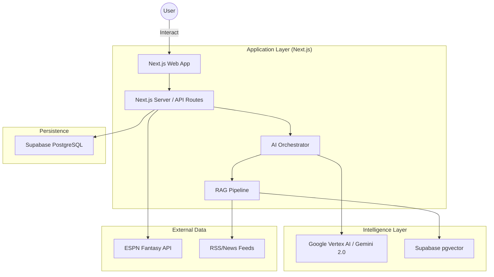

# System Architecture

FanVise is a modern, AI-native fantasy sports intelligence platform. For the Proof of Concept (PoC) phase, the application is built as a unified Next.js solution to maximize development speed and minimize infrastructure complexity.

## High-Level Overview

The system follows a "Savant" model: it acts as a strategic layer on top of existing fantasy sports platforms (starting with ESPN Fantasy Basketball).

## Key Architectural Principles

1. **Perspective Engine**: The core logic is decoupled from a single user's team. The system can adopt the "perspective" of any team in a league to analyze strengths and weaknesses.
2. **AI-First Orchestration**: The AI is not a separate feature but the primary interface for decision-making.
3. **Hybrid RAG**: Combines structured league data (rosters, scoring) with unstructured news and intelligence (injury reports, trade rumors).
4. **Edge Readiness**: Built on Next.js 15+ with Tailwind CSS v4, optimized for low latency and responsive interactions.

## Deployment Stack

- **Frontend/Backend**: Next.js (Deployed on Vercel)
- **Database/Auth**: Supabase (PostgreSQL + pgvector)
- **AI Models**: Google Gemini 2.0 Flash (via Google Generative AI SDK)
- **Data Ingestion**: Custom TypeScript clients for ESPN and RSS scraping.
