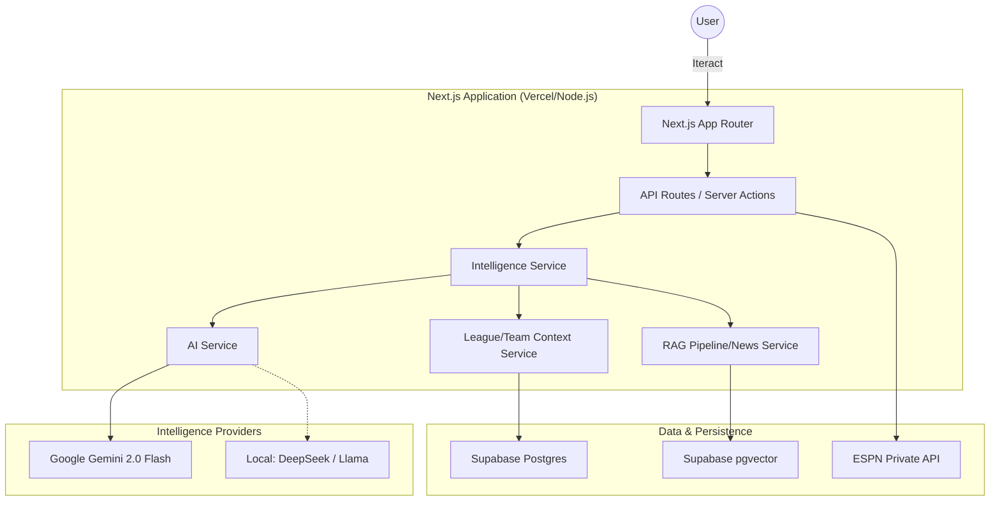

# System Architecture

FanVise is an AI-native fantasy sports intelligence platform designed as a "Savant" layer on top of existing fantasy ecosystem. The application is built as a unified, standalone Next.js solution that integrates data ingestion, AI orchestration, and RAG pipelines into a single high-performance deployment.

## High-Level Overview

The system acts as a strategic co-manager for ESPN Fantasy Basketball. It aggregates structured data (league rosters, scoring) and unstructured intelligence (news, injury reports) to provide contextually grounded strategic advice.

## Key Architectural Principles

1. **Perspective Engine**: The core logic is decoupled from a single user's team. The system can adopt the "perspective" of any team in a league to analyze strengths and weaknesses.
2. **AI-First Orchestration**: The AI is not a separate feature but the primary interface for decision-making.
3. **Hybrid RAG**: Combines structured league data (rosters, scoring) with unstructured news and intelligence (injury reports, trade rumors).
4. **Edge Readiness**: Built on Next.js 15+ with Tailwind CSS v4, optimized for low latency and responsive interactions.

## Deployment Stack

- **Frontend/Backend**: Next.js (Deployed on Vercel)
- **Database/Auth**: Supabase (PostgreSQL + pgvector)
- **AI Models**: Google Gemini 2.0 Flash (via Google Generative AI SDK)
- **Data Ingestion**: Custom TypeScript clients for ESPN and RSS scraping.
