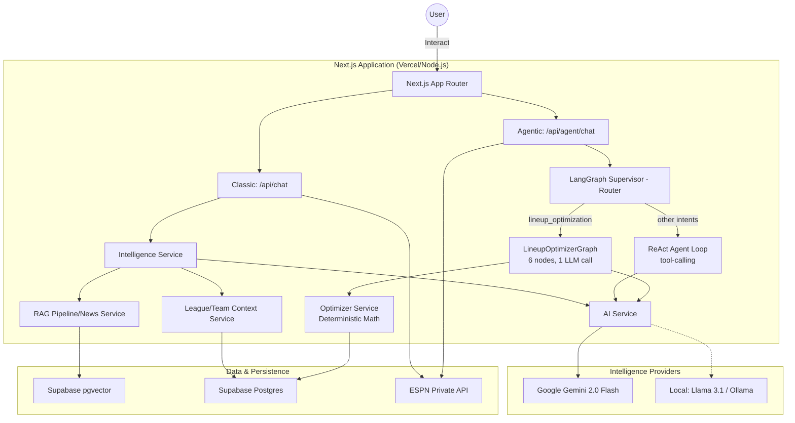

# System Architecture

FanVise is an AI-native fantasy sports intelligence platform designed as a "General Manager" layer on top of existing fantasy ecosystem. The application is built as a unified, standalone Next.js solution that integrates data ingestion, AI orchestration, and RAG pipelines into a single high-performance deployment.

## High-Level Overview

The system acts as a strategic co-manager (General Manager) for ESPN Fantasy Basketball. It aggregates structured data (league rosters, scoring) and unstructured intelligence (news, injury reports) to provide contextually grounded strategic advice. It employs a **Dual-Environment Architecture**, offering both high-performance cloud inference and privacy-focused local models.

## Dual-Mode AI Execution

The system provides two active AI execution paths:

1. **Classic Mode (`/api/chat`)**: single-pass Retrieval-Augmented Generation (RAG) via `IntelligenceService` for fast, deterministic strategy answers.
2. **Agentic Mode (`/api/agent/chat`)**: LangGraph supervisor orchestration with tool-calling for deeper, iterative analysis.

## Key Architectural Principles

1. **Setting-Driven Perspective**: The core logic is driven by the user's `activeLeagueId` and `activeTeamId` settings. The system can switch perspective to any team in a league (e.g., to simulate an opponent) simply by changing these settings.
2. **AI-First Orchestration**: The AI is not a separate feature but the primary interface for decision-making.
3. **Hybrid RAG**: Combines structured league data (rosters, scoring) with unstructured news and intelligence (injury reports, trade rumors).
4. **Edge Readiness**: Built on Next.js 15+ with Tailwind CSS v4, optimized for low latency and responsive interactions.

## Deployment Stack

- **Frontend/Backend**: Next.js (Deployed on Vercel)
- **Database/Auth**: Supabase (PostgreSQL + pgvector)
- **AI Models**: Google Gemini 2.0 Flash (via Google Generative AI SDK)
- **Data Ingestion**: Custom TypeScript clients for ESPN and RSS scraping.

## Sync Orchestration

FanVise now separates league synchronization from news intelligence ingestion so costly AI/pgvector writes only happen on explicit paths.

- **Scheduled News Sync (automatic, restricted):**
  - Route: `GET /api/cron/news`
  - Scope: **news-only** ingestion (`fetchAndIngestNews`) with Gemini extraction/embeddings.
  - Guardrails: production-only, optional `CRON_SECRET`, and strict UTC windows (`11:00` and `22:00`).
  - Trigger: GitHub Actions workflow `.github/workflows/news-ingest-cron.yml`.

- **Manual News Sync (operator action):**
  - Route: `POST /api/news/sync`
  - Scope: **news-only** ingestion/backfill.
  - Guardrails: requires explicit intent header `x-fanvise-sync-intent: manual-news-sync`.
  - UI: Dashboard `Sync News` button with last-sync label.

- **League Sync (separate from news):**
  - Routes: `POST /api/sync`, `POST /api/sync/player-status`, `POST /api/sync/daily-leaders`
  - Scope: ESPN league metadata, transactions, player status snapshots, and daily leaders.
  - Single-league mode: league/season are read from `NEXT_PUBLIC_ESPN_LEAGUE_ID` and `NEXT_PUBLIC_ESPN_SEASON_ID`.
  - Note: daily leaders sync now performs a best-effort schedule sync if no scoring period can be resolved yet.
  - UI: Dashboard `Sync League` button.

## Production Mode Notes (Current)

- **Current live mode**: single-league, env-driven perspective (not full multi-user `profiles`/`user_leagues` flow).
- **Public perspective fallback**: controlled by `ALLOW_PUBLIC_PERSPECTIVE_FALLBACK` (and defaults to enabled outside production).
- **Gemini retry cap**: `RETRY_MAX_DELAY_MS` is used to prevent long 429 backoffs from causing runtime hangs.

## Rollback / Future Reversal

When multi-user auth is fully implemented in production, revert this temporary single-league posture:

1. Set `ALLOW_PUBLIC_PERSPECTIVE_FALLBACK=false`.
2. Keep `user_leagues` populated for authenticated users and enforce membership-only perspective.
3. Optionally remove first-team fallback defaults in client perspective resolution.
