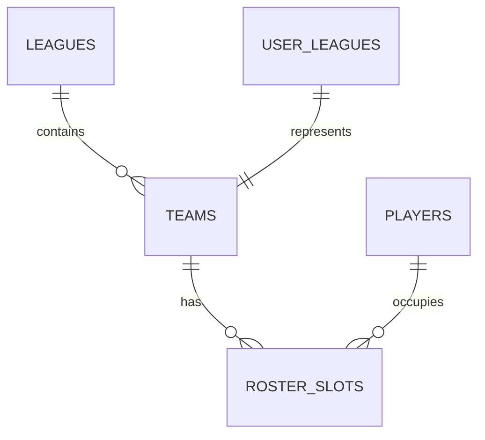

# Database Schema & Data Strategy

FanVise uses Supabase (PostgreSQL) as its primary data store. The schema is designed to support the "Perspective Engine" and RAG-based intelligence.

## Core Schema

### Leagues & Teams
- **`leagues`**: Stores ESPN league metadata, including `scoring_settings` and `roster_slots` (stored as JSONB for flexibility across different league formats).
- **`teams`**: Maps to ESPN teams. Includes a flag `is_user_owned` to identify primary perspective.
- **`user_leagues`**: Junction table linking authenticated users to their specific teams and leagues.

### Players & Stats
- **`players`**: Canonical player data (ESPN IDs, names, positions).
- **`roster_slots`**: Tracks which players are on which teams for a given `as_of_date`.

### Intelligence Layer (RAG)
- **`news_intelligence`**: Stores scraped news articles.
- **`embeddings`**: (Managed via `pgvector`) Stores vector representations of news content for semantic search.

## Perspective Engine Relational Logic

The "Perspective Engine" works by dynamically injecting context into the application based on the `activeTeamId`. 

## Data Freshness & Sync

The system uses a snapshot-based synchronization strategy:
1. **Scraping**: Fetches raw JSON from ESPN API.
2. **Normalization**: Processes raw data into the relational schema.
3. **Consistency**: `last_sync` timestamps verify that the AI is not providing advice based on stale data.
