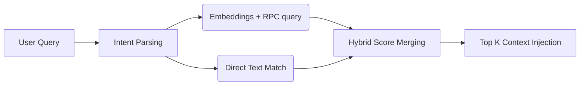

# The RAG & Intelligence Pipeline

The retrieval-augmented generation (RAG) pipeline is responsible for maintaining the "Real-Time Intelligence" context for FanVise. By injecting current NBA news, injury reports, and trade rumors into the prompt, it prevents the LLM from making decisions based on stale or ungrounded training data.

## 🔄 The 3-Stage Pipeline

The pipeline operates in three distinct stages:

### 1. Ingestion (RSS/ESPN)
NBA news is ingested from high-trust sources (e.g., ESPN, Rotowire). The system evaluates potential news items based on relevance and specific NBA keywords to reduce noise. See [News Ingestion Engine](./News-Ingestion.md) for full ingestion details.

### 2. Extraction (AI Metadata)
Each ingested news item is passed to an AI Service (driven by Gemini) to extract structured intelligence:
* **Primary Player:** Who is the article about?
* **Sentiment & Category:** Is this an injury, trade, or lineup adjustment?
* **Impact Backup:** Who gains fantasy value if the primary player is injured?
* **Injury Status & Expected Return Date**

This structured metadata (`IntelligenceObject`) is generated using `extractIntelligence`. Alongside this, the system generates a standard text embedding.

### 3. Retrieval (Hybrid Vector Search)
When a user asks a question, the pipeline synthesizes both semantic similarity and exact keyword matching to fetch context.

## ⚖️ `computeHybridScore` Logic

The retrieval system uses a custom scoring formula (`computeHybridScore`) to rank results. The final score blends five different aspects:

1. **Vector Score (50%)**: Semantic similarity returned by pgvector.
2. **Keyword Score (20%)**: Traditional search term hit rate (`textHitScore`).
3. **Player Match Score (20%)**: Did the semantic query contain a specific player name that exactly hits the underlying article? (`getPlayerMatchScore`)
4. **Recency Score (7%)**: Linear decay based on publish date. Drops to 0 after ~7 days.
5. **Trust Score (3%)**: A baseline score based on the reliability of the source feed.

**Contextual Boosting:** If the query exhibits an "Injury Intent", articles explicitly flagged as `is_injury_report=true` receive an artificial score bump.

## 🛡️ Graceful Degradation Strategy

FanVise is built to be resilient against external API failures (e.g., missing API keys or Gemini 429 Rate Limits).

When standard vector embedding generation fails or the `GOOGLE_API_KEY` is missing:
* A warning is logged: `[News Service] GOOGLE_API_KEY missing — vector search disabled, falling back to lexical-only.`
* The synchronous Lexical Path continues unabated, executing `ilike` operations across titles and summaries in Supabase.
* The hybrid pipeline simply combines an empty array `[]` with the returned lexical rows matching the query intent, ensuring the end user still receives relevant, freshly ingested news context.

## 🚀 Room for Improvement / Next Steps
* **HNSW Index Scaling:** The current pgvector implementation utilizes `<=>` exact nearest neighbor scanning. As the database scales beyond hundreds of thousands of news rows, indexing needs to be upgraded to HNSW (Hierarchical Navigable Small World) indexes within Supabase to preserve sub-100ms vector matching.
* **Personalized RAG Feeds:** Modifying retrieval weights to prefer news regarding players *currently on the user's active roster* rather than global league news.
