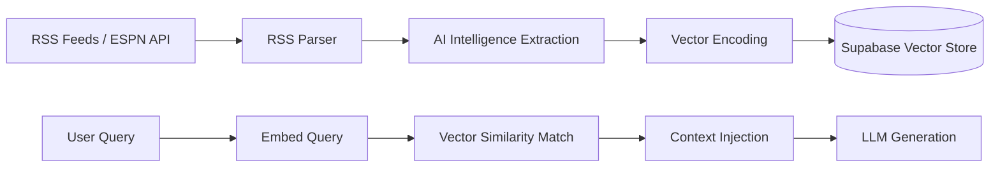

# RAG Pipeline & Intelligence Extraction

FanVise uses a Retrieval-Augmented Generation (RAG) pipeline to ground its AI advice in real-time NBA news and injury reports.

## Pipeline Overview

The pipeline consists of three primary stages: **Ingestion**, **Intelligence Extraction**, and **Contextual Retrieval**.

## 1. Ingestion Strategy

News is ingested through two primary channels:
- **RSS Feeds**: Real-time polling of feeds from Rotowire, ESPN, Yahoo Sports, and CBS Sports.
- **Historical Backfill**: Direct integration with the ESPN News API to fetch historical context up to 14 days back.

### Execution Guardrails

- **Automatic ingestion** is restricted to exactly two daily cron windows (`11:00` and `22:00` UTC) via `/api/cron/news`.
- **Manual ingestion** happens from the Dashboard `Sync News` action only and requires explicit manual intent metadata.
- **League sync operations** (league metadata, transactions, player statuses, daily leaders) are intentionally separated from news ingestion to avoid unintended Gemini/pgvector costs.

## 2. Intelligence Extraction

Every ingested article is processed by the AI Service to extract structured metadata. This ensures the AI can reason about the *impact* of news, not just the text.

**Extracted Schema:**
- `player_name`: The primary player affected.
- `sentiment`: POSITIVE | NEGATIVE | NEUTRAL.
- `category`: Injury | Trade | Lineup | Performance | General.
- `impact_backup`: Teammates who gain value (e.g., if a starter is injured).
- `injury_status`: GTD | OUT | Questionable | etc.

## 3. Retrieval & Grounding

During a chat session, the system performs a semantic search using the user's query.
- **Embedding Model**: Defaults to `gemini-embedding-001` (Gemini) or `nomic-embed-text` (Local).
- **Match Strategy**: Uses Cosine Similarity via the `match_news_documents` RPC.
- **Grounding Rules**: The **General Manager** persona is instructed to ignore its pre-trained knowledge and *only* use the retrieved intelligence items to form responses. Trash talk remains data-anchored to prevent hallucinations.
