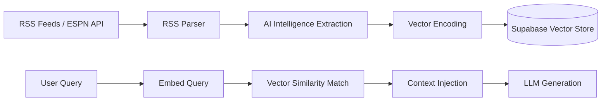

# RAG Pipeline & Intelligence Extraction

FanVise uses a Retrieval-Augmented Generation (RAG) pipeline to ground its AI advice in real-time NBA news and injury reports.

## Pipeline Overview

The pipeline consists of three primary stages: **Ingestion**, **Intelligence Extraction**, and **Contextual Retrieval**.

## 1. Ingestion Strategy

News is ingested through two primary channels and strategies:
- **Static-Cron Strategy**: Scheduled ingestion from **RSS Feeds** (Rotowire, ESPN, Yahoo, CBS) and **Historical Backfill** via ESPN APIs at set intervals.
- **Live-First Retrieval Strategy**: An on-demand **Parallel Search** triggered by user queries. When a manager asks about a specific player, the system returns cached DB results immediately while simultaneously triggering a background/synchronous live-fetch (e.g. Edge Function) if the cache is older than X minutes. This ensures the DB is incrementally updated without blocking the UI response.

### Execution Guardrails

- **Automatic ingestion** is restricted to exactly two daily cron windows (`11:00` and `22:00` UTC) via `/api/cron/news`.
- **Manual ingestion** happens from the Dashboard `Sync News` action only and requires explicit manual intent metadata.
- **League sync operations** (league metadata, transactions, player statuses, daily leaders) are intentionally separated from news ingestion to avoid unintended Gemini/pgvector costs.

## 2. Intelligence Extraction

Every ingested article is processed by the AI Service to extract structured metadata. This ensures the AI can reason about the *impact* of news, not just the text.

**Extracted Schema:**
- `player_name`: The primary player affected.
- `sentiment`: POSITIVE | NEGATIVE | NEUTRAL.
- `category`: Injury | Trade | Lineup | Performance | General.
- `impact_backup`: Teammates who gain value (e.g., if a starter is injured).
- `injury_status`: GTD | OUT | Questionable | etc.

## 3. Retrieval & Grounding

During a chat session, the system performs a semantic search using the user's query.
- **Embedding Model**: Defaults to `gemini-embedding-001` (Gemini) or `nomic-embed-text` (Local).
- **Match Strategy**: Hybrid — cosine similarity via `match_news_documents` RPC **plus** lexical keyword search merged and re-ranked by `computeHybridScore`.
- **Graceful Degradation**: If `GOOGLE_API_KEY` is absent or the embedding provider fails, the vector step is skipped and the search falls back to lexical-only. The pipeline never returns an empty result set solely because an API key is missing.
- **Grounding Rules**: The **General Manager** persona is instructed to ignore its pre-trained knowledge and *only* use the retrieved intelligence items to form responses. Trash talk remains data-anchored to prevent hallucinations.

### Hybrid Score Weights

| Signal | Weight |
|--------|--------|
| Vector similarity | 50% |
| Keyword match | 20% |
| Player name match | 20% |
| Recency (0 after 7 days) | 7% |
| Source trust level | 3% |

### Database Indexes

The `news_items` table has the following performance indexes:
- `idx_news_items_published_at (published_at DESC)` — accelerates the date-window filter in all news queries.
- `idx_news_items_source_published_at (source, published_at DESC)` — accelerates per-source recency queries.
- `news_items_guid_idx (guid)` — deduplication during ingestion.
- HNSW index on `embedding` deferred until table exceeds ~5k rows (Supabase best practice).
